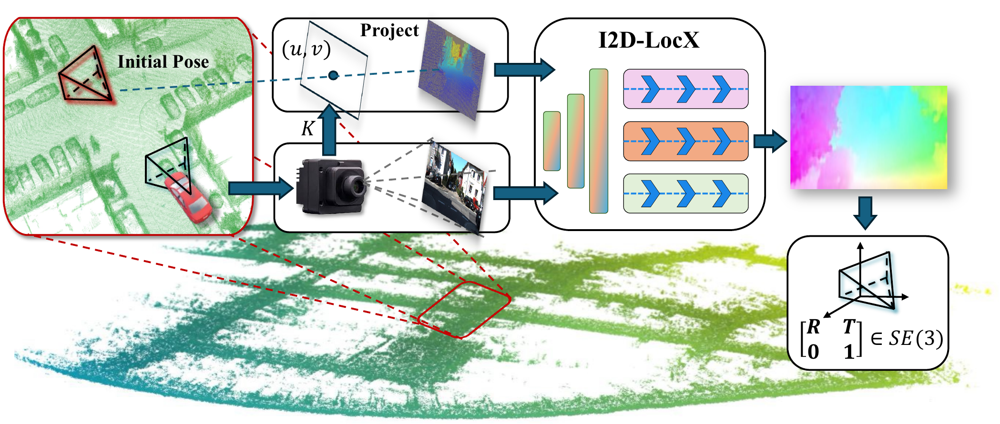

<div align="center">

# I2D-LocX

**An Efficient, Precise and Robust Method for Camera Localization in LiDAR Maps**

[](https://ieeexplore.ieee.org/document/11045122)
[](https://doi.org/10.1109/LRA.2025.3581122)
[](https://huggingface.co/xubo3/I2D-LocX)



</div>

## 1. Introduction

I2D-LocX is an efficient, precise, and robust camera localization method for LiDAR maps. Given a camera image and a LiDAR map, the method estimates dense image-to-depth flow and recovers the relative 6-DoF transformation through PnP. This repository provides the inference code, the updated CUDA visibility extension, a pretrained KITTI checkpoint, and a small sample dataset for quick reproduction.

This project is based on [I2D-Loc](https://github.com/EasonChen99/I2D-Loc). The `visibility` package has been updated for I2D-LocX, so please use the implementation included in this repository instead of the original I2D-Loc visibility package.

## 2. News

- **2025.6:** I2D-LocX was published in **IEEE Robotics and Automation Letters (RA-L)**.
- **2025.9:** I2D-LocX was transferred to **ICRA 2026** for presentation.

## 3. Requirements and Installation

### 3.1 Tested Environment

The project was developed and evaluated on Ubuntu 20.04 with Python 3.11, PyTorch 2.7.0, and CUDA 11.8. Inference requires an NVIDIA GPU, a working CUDA toolkit, and a C++ compiler compatible with the installed PyTorch build.

### 3.2 Create the Environment

```bash
conda create -n i2d-locx python=3.11 -y
conda activate i2d-locx
```

### 3.3 Install PyTorch

Install the PyTorch build that matches your CUDA environment. The following command installs the CUDA 11.8 build:

```bash
pip install torch torchvision torchaudio --index-url https://download.pytorch.org/whl/cu118
```

For other CUDA versions, refer to the official [PyTorch installation guide](https://pytorch.org/get-started/locally/).

### 3.4 Install Dependencies

```bash
pip install -r requirements.txt
```

### 3.5 Build the Visibility Package

```bash
cd pkg/visibility_package
python setup.py install
cd ../..
```

Verify the installation:

```bash
python -c "import visibility; print('visibility extension is available')"
```

## 4. Pretrained Checkpoint

The sample configuration uses the KITTI checkpoint `kitti_100epoch.pth`. Download it from [Hugging Face](https://huggingface.co/xubo3/I2D-LocX), then place it in the following location:

```text
checkpoints/kitti_100epoch.pth
```

The expected directory structure is:

```text
i2d-locX-open/
└── checkpoints/
    └── kitti_100epoch.pth
```

## 5. Data Preparation

### 5.1 Original Datasets

The full training and evaluation datasets follow the preparation procedure of the original [I2D-Loc repository](https://github.com/EasonChen99/I2D-Loc#required-data). I2D-Loc uses the [KITTI Odometry Dataset](https://www.cvlibs.net/datasets/kitti/eval_odometry.php) and aggregates LiDAR scans at their ground-truth poses to construct complete maps. The maps are downsampled at a resolution of 0.1 m and stored as HDF5 files. Please refer to the original repository for the full KITTI preprocessing scripts and directory layout.

### 5.2 Sample Dataset

This repository includes a small sample dataset containing four image and LiDAR-map pairs from KITTI odometry sequence 00, allowing the inference pipeline to be tested without preparing the complete dataset.

```text
sample/
└── 0/
    ├── image/
    │   ├── 000000.png
    │   ├── 000100.png
    │   ├── 000200.png
    │   └── 000300.png
    └── lidar/
        ├── 000000.h5
        ├── 000100.h5
        ├── 000200.h5
        └── 000300.h5
```

Images and LiDAR maps are paired by filename. The sample camera intrinsics are defined in `core/dataset.py`.

## 6. Quick Start

Run the sample from the repository root:

```bash
bash cmd/sample.sh
```

The script executes:

```bash
python sample.py --cfg cfg/sample.toml --checkpoint checkpoints/kitti_100epoch.pth
```

The default configuration uses GPU `0`, generates deterministic initial pose perturbations with seed `3407`, and evaluates all four sample pairs.

## 7. Results

Each run creates a timestamped output directory:

```text
i2d_locX_sample/test/test_<YYYYMMDD_HHMMSS>/
├── logs/
│   └── test.log
└── result/
    ├── iter_1/
    ├── iter_2/
    ├── iter_3/
    └── iter_4/
```

Each iteration directory contains `vision_image_with_initial.png` for the initial LiDAR projection, `vision_image_with_initial_gt.png` for the ground-truth alignment, and `vision_image_with_predict.png` for the alignment after pose correction. The terminal and `test.log` report the initial and predicted rotation and translation errors.

## 8. Configuration

The sample configuration is located at `cfg/sample.toml`.

| Option | Description |
| --- | --- |
| `gpus` | CUDA device list; the sample uses `[0]` |
| `dataset.root_folder` | Root directory of the input data |
| `dataset.test_sequence` | Sequence used for evaluation |
| `dataset.max_r` | Maximum sampled rotation perturbation in degrees |
| `dataset.max_t` | Maximum sampled translation perturbation |
| `dataset.batch_size` | Evaluation batch size |
| `model.iters` | Number of iterative flow-refinement steps |

## 9. Troubleshooting

- **`No CUDA devices available`:** Run `nvidia-smi` and `python -c "import torch; print(torch.cuda.is_available(), torch.version.cuda)"` to verify the NVIDIA driver and PyTorch CUDA build.
- **`ModuleNotFoundError: No module named 'visibility'`:** Rebuild the extension with `cd pkg/visibility_package && python setup.py install`.
- **`Checkpoint not found`:** Place the model at `checkpoints/kitti_100epoch.pth` or pass its actual location through `--checkpoint`.
- **CUDA out of memory:** Keep `dataset.batch_size = 1` and close other GPU workloads.

## 10. Citation

If you find this project useful, please cite our IEEE RA-L paper:

```bibtex
@article{yu2025i2dlocx,
  title={I2D-LocX: An Efficient, Precise and Robust Method for Camera Localization in LiDAR Maps},
  author={Yu, Huai and Zhu, Xubo and Han, Shu and Yang, Wen and Xia, Gui-Song},
  journal={IEEE Robotics and Automation Letters},
  volume={10},
  number={8},
  pages={7899--7906},
  year={2025},
  doi={10.1109/LRA.2025.3581122}
}
```

## 11. Acknowledgments

This repository is developed from [I2D-Loc](https://github.com/EasonChen99/I2D-Loc). The original I2D-Loc implementation builds upon [CMRNet](https://github.com/cattaneod/CMRNet), [RAFT](https://github.com/princeton-vl/RAFT), and [BPnP](https://github.com/BoChenYS/BPnP). We thank the authors for making their work publicly available.
